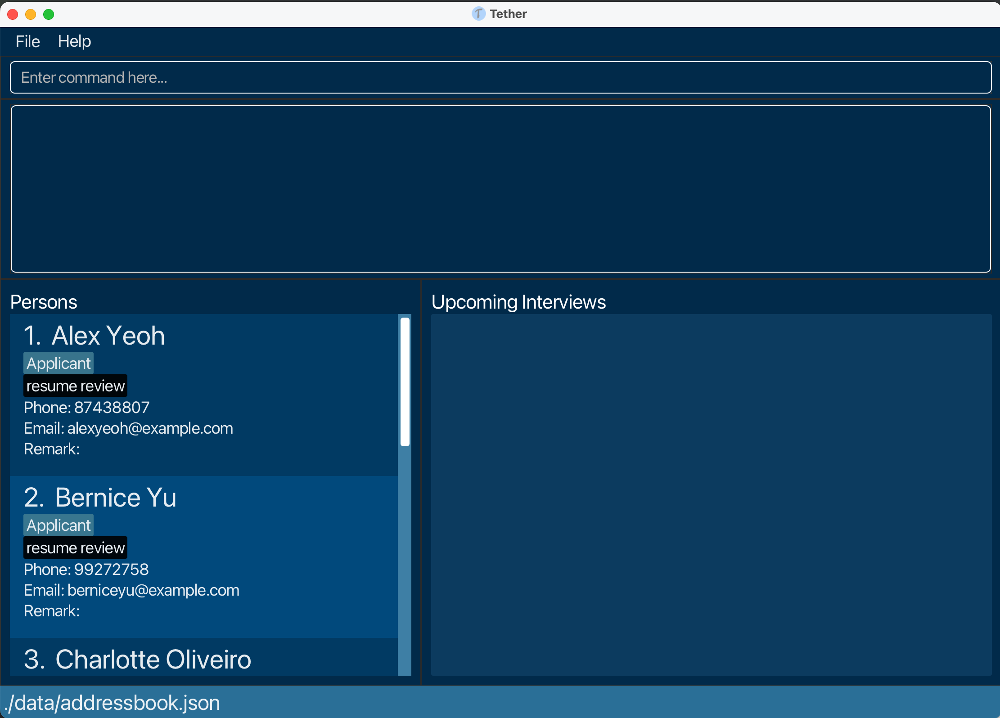

# TalentTracker User Guide

TalentTracker is a **desktop app for managing contacts, optimized for use via a Line Interface** (CLI)
while still having the benefits of a Graphical User Interface (GUI).
If you can type fast, TalentTracker can get your hiring management tasks done faster than traditional GUI apps.

<!-- * Table of Contents -->
<page-nav-print />

--------------------------------------------------------------------------------------------------------------------

## Quick start

1. Ensure you have Java `11` or above installed in your Computer.

1. Download the latest `talenttracker.jar` from [here](https://github.com/se-edu/addressbook-level3/releases).

1. Copy the file to the folder you want to use as the _home folder_ for your TalentTracker.

1. Open a command terminal, `cd` into the folder you put the jar file in, and use the `java -jar talenttracker.jar`
   command to run the application. 
   A GUI similar to the below should appear in a few seconds. Note how the app contains some sample data. 
   

1. Type the command in the command box and press Enter to execute it.
2. Refer to the [Features](#features) below for details of each command.

 

--------------------------------------------------------------------------------------------------------------------

## Features

**Notes about the command format:** 

* Parameters must be in any order. 
  e.g. if the command specifies `<name>, <email>,<phone number>`, they must be typed in that order.

* Commands are case-insensitive. 
 e.g if the user types `ADD INTERVIEW`, it is interpreted as `add interview`.

* Extraneous parameters for commands that do not take in parameters (such as `help`, `exit`) will be
  ignored. 
  e.g. if the command specifies `help 123`, it will be interpreted as `help`.

* If you are using a PDF version of this document, be careful when copying and pasting commands that span multiple lines
  as space characters surrounding line-breaks may be omitted when copied over to the application.
  </box>

## Adding an applicant: `add applicant`

Adds an applicant to the hiring tracker.

Format: `add applicant <name>, <email>,<phone number>`

Examples:

* `add applicant John Doe, johndoe123@gmail.com, 81239123`

## Adding a interviewer: `add interviewer`

Adds an interviewer to the hiring tracker.

Format: `add interviewer <name>, <email>,<phone number>`

Examples:

* `add interviewer John Doe, johndoe123@gmail.com, 81239123`

## Adding a interview: `add interview`

Adds an interview to the hiring tracker.

Format: `add interview <description>, <start>, <end>, <applicant phone number>, <interviewer phone number>`

Examples:

* `add interview Round 1, 30-01-2024 1200, 30-01-2024 1500, 81239123, 91238123`

## Deleting an applicant/interviewer : `delete`

Deletes the specified applicant/interviewer from the hiring tracker.

Format: `delete <phone number of applicant/interviewer>`

* Deletes the person with the specified phone number.

Examples:

* If there exists an applicant/interviewer with phone number 81239123, `delete 81239123` would delete that
  applicant/interviewer.

## Deleting an interview : `delete interview`

Deletes the specified interview from the hiring tracker based on **index**.

Format: `delete interview <interview index>`

Examples:

* `delete interview 1` would delete the first interview in the hiring tracker.

## Exiting the program : `exit`

Exits the program.

Format: `exit`

## Saving the data

TalentTracker data are saved in the hard disk automatically after any command that changes the data.
There is no need to save manually.

## More features to come `[coming in v2.0]`

_Details coming soon ..._

--------------------------------------------------------------------------------------------------------------------

## FAQ

**Q**: How do I transfer my data to another Computer? 
**A**: Install the app in the other computer and overwrite the empty data file it creates with the file that contains
the data of your previous TalentTracker home folder.

--------------------------------------------------------------------------------------------------------------------

## Command summary

 Action     | Format, Examples                                                                                                                                                      
------------|-----------------------------------------------------------------------------------------------------------------------------------------------------------------------
 **Add Applicant**    | `add applicant <name>, <email>,<phone number>`   e.g., `add applicant John Doe, johndoe123@gmail.com, 81239123` 
 **Add Interviewer**  | `add interviewer <name>, <email>,<phone number>`   e.g., `add interviewer John Doe, johndoe123@gmail.com, 81239123`                                                                                                                                                                
 **Add Interview** | `add interview <description>,<start>, <end>, <applicant phone number>, <interviewer phone number>`  e.g., `add interview Round 1, 30-01-2024 1200, 30-01-2024 1500, 81239123, 91238123`                                                                                                                                  
 **Delete Applicant/Interviewer**   | `delete <phone number of applicant/interviewer>`   e.g.,`delete 81239123` would delete the entity with that phone number                                            
 **Delete Interview**   | `delete interview <interview index>`,   e.g `delete 1' would delete the first interview in the list                                                                                                            
 **Exit**   | `Exit`                                                                                                                                                                
                                                                                                                                                              
